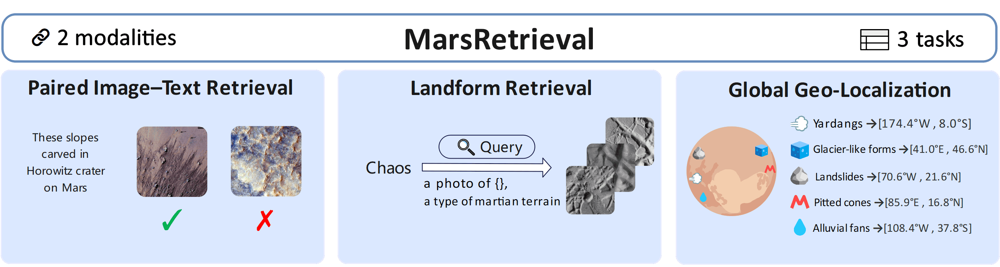

#  MarsRetrieval: Benchmarking Vision-Language Models for Planetary-Scale Geospatial Retrieval on Mars


<p align="center">
  <a href="https://arxiv.org/">📘 Paper</a>  |
  <a href="https://huggingface.co/collections/SUSTech/marsretrieval">🤗 Datasets</a>

</p>


<p align="center">
  Shuoyuan Wang<sup>1</sup>, Yiran Wang<sup>2</sup>, Hongxin Wei<sup>1*</sup>
</p>

<p align="center">
  <sup>1</sup>Department of Statistics and Data Science, Southern University of Science and Technology, Shenzhen, China<br/>
  <sup>2</sup>Department of Earth and Space Sciences, Southern University of Science and Technology, Shenzhen, China<br/>
  <sup>*</sup>Corresponding author
</p>

## Overview
We introduce MarsRetrieval, an extensive retrieval benchmark for evaluating the utility of vision-language models in Martian geospatial discovery. Specifically, MarsRetrieval organizes evaluation into 3 complementary tasks: (1) paired image–text retrieval, (2) landform retrieval and (3) global geo-localization, covering multiple spatial scales and diverse geomorphic origins. MarsRetrieval aims to bridge the gap between multimodal AI capabilities and the needs of real-world planetary research.


<p align="center">
  
  <br>
</p>


## Setup

**1. Installation**

For installation and other package requirements, please follow the instructions detailed in [docs/INSTALL.md](docs/INSTALL.md).

**2. Data preparation**

Please follow the instructions at [docs/DATASET.md](docs/DATASET.md) to prepare all datasets.

## Quick Start

Example runs by task (e.g., [PE-Core](https://arxiv.org/abs/2504.13181), [Qwen3-VL-Embedding](https://arxiv.org/abs/2601.04720),  [MarScope](https://arxiv.org/abs/2601.15949)):

**Paired Image-Text Retrieval**
```bash
GPU_ID=0
bash scripts/paired_image_text_retrieval/openclip.sh ${GPU_ID}
bash scripts/paired_image_text_retrieval/qwen3_vl_embedding.sh ${GPU_ID}
bash scripts/paired_image_text_retrieval/marscope.sh ${GPU_ID}
```

**Landform Retrieval**
```bash
GPU_ID=0
bash scripts/landform_retrieval/openclip.sh ${GPU_ID}
bash scripts/landform_retrieval/qwen3_vl_embedding.sh ${GPU_ID}
bash scripts/landform_retrieval/marscope.sh ${GPU_ID}
```

**Global Geo-Localization**

We highly recommend building the database in distributed mode first, then you can run experiments on a single GPU.
```bash
# Distributed DB build
bash scripts/geolocalization/marscope.sh 0,1,2,3,4,5,6,7

# Single-GPU runs
GPU_ID=0
bash scripts/geolocalization/openclip.sh ${GPU_ID}
bash scripts/geolocalization/qwen3_vl_embedding.sh ${GPU_ID}
bash scripts/geolocalization/marscope.sh ${GPU_ID}
```

For more models, see the scripts under [scripts/geolocalization](scripts/geolocalization), [scripts/landform_retrieval](scripts/landform_retrieval), and [scripts/paired_image_text_retrieval](scripts/paired_image_text_retrieval), respectively.

## Supported Models

**Encoder-based**

| Model | Paper | Code |
|---|---|---|
| DFN2B-CLIP-ViT-L-14 | [link](https://arxiv.org/abs/2309.17425) | [link](https://github.com/apple/axlearn) |
| ViT-L-16-SigLIP-384 | [link](https://arxiv.org/abs/2303.15343) | [link](https://github.com/google-research/big_vision) |
| ViT-L-16-SigLIP2-512 | [link](https://arxiv.org/abs/2502.14786) | [link](https://github.com/google-research/big_vision) |
| PE-Core-L-14-336 | [link](https://arxiv.org/abs/2504.13181) | [link](https://github.com/facebookresearch/perception_models) |
| BGE-VL-large | [link](https://arxiv.org/abs/2412.14475) | [link](https://github.com/VectorSpaceLab/MegaPairs) |
| aimv2-large-patch14-224 | [link](https://machinelearning.apple.com/research/multimodal-autoregressive) | [link](https://github.com/apple/ml-aim) |
| aimv2-large-patch14-448 | [link](https://machinelearning.apple.com/research/multimodal-autoregressive) | [link](https://github.com/apple/ml-aim) |
| dinov3-vitl16 | [link](https://arxiv.org/abs/2508.10104) | [link](https://github.com/facebookresearch/dinov3) |

**MLLM-based**

| Model | Paper | Code |
|---|---|---|
| E5-V | [link](https://arxiv.org/abs/2407.12580) | [link](https://github.com/kongds/E5-V) |
| gme | [link](https://arxiv.org/abs/2412.16855) | [link](https://huggingface.co/Alibaba-NLP/gme-Qwen2-VL-2B-Instruct) |
| B3++ | [link](https://arxiv.org/abs/2505.11293) | [link](https://huggingface.co/raghavlite/B3_Qwen2_2B) |
| jina-embeddings-v4 | [link](https://arxiv.org/abs/2506.18902) | [link](https://huggingface.co/jinaai/jina-embeddings-v4) |
| VLM2Vec-V2.0 | [link](https://arxiv.org/abs/2507.04590) | [link](https://tiger-ai-lab.github.io/VLM2Vec/) |
| Ops-MM-embedding-v1 | [link](https://huggingface.co/OpenSearch-AI/Ops-MM-embedding-v1-2B) | [link](https://huggingface.co/OpenSearch-AI/Ops-MM-embedding-v1-2B) |
| Qwen3-VL-Embedding | [link](https://arxiv.org/abs/2601.04720) | [link](https://github.com/QwenLM/Qwen3-VL-Embedding) |

<!-- Note: If no formal paper is available, the Paper link points to the model card. -->

<!-- ## Notes

- Entrypoint: `main.py`
- Runner scripts: `scripts/` -->

## Citation

If you find this useful in your research, please consider citing:
```
@inproceedings{wang2025marsretrieval,
  title={MarsRetrieval: Benchmarking Vision-Language Models for Planetary-Scale Geospatial Retrieval on Mars},
  author={Wang, Shuoyuan and Wang, Yiran and Wei, Hongxin},
  booktitle = {ArXiv},
  year = {2026}
}
```
